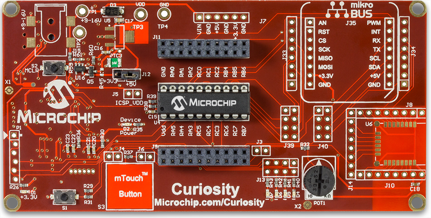

 
# Curiosity Board

The original Curiosity Development Board (Part Number: DM164137) continues to be one of our most popular development boards. Curiosity is designed to support 8-, 14-, and 20-pin 8-bit PIC MCUs with low voltage programming capability.
