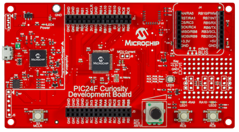

 
# Curiosity PIC24F Board (16-bits)

The PIC24F Curiosity Development Board (Part Number: **DM240004**) is a low-cost platform with an integrated programmer and debugger and easy expandability with a mikroBUS™ interface to utilize click boards for customizing your application.

# Features

* Features PIC24FJ128GA204 low power (XLP) microcontroller with an integrated Cryptographic engine
* Integrated programmer/debugger with USB interface
* Analog potentiometer, multiple user LED’s, RGB LED and switches
* Full compatibility with MPLAB Xpress, MPLAB X IDE, XC16 compiler and MPLAB Code Configurator
* Functionality expansion support with mikroBUS™ interface for Click™ Boards
* Wireless connectivity provision with Microchip’s BM71 Bluetooth LE module footprint

