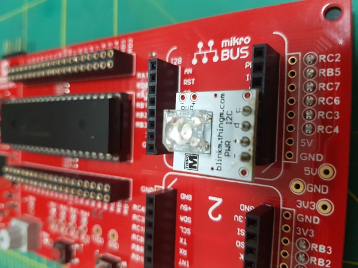
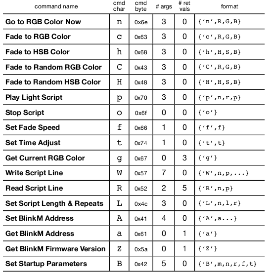

# BlinkM Library

A simple library to control BlinkM module using I2C bus on Microchip Curiosity Board with PIC16F18875 MCU.

the BlinkM is connected to Curiosity HPC Board as following:
 
    BlankM  MikroBus    Curiosity HPC   Remarks
-------------------------------------------------------------------
    I2C C   SCL         RC3             I2C clock
    I2C D   SDA         RC4             I2C data
    PWR-    GND         GND             Ground
    PWR+    +5V         +5V             Power supply
-------------------------------------------------------------------

 * Used Pins:
-------------------------------------------------------------------
 * RC3  >   I2C SCL :must have pull-up resistors enabled since BlinkM does not have pull-up resistors on its module.
 * RC4  >   I2C SDA :must have pull-up resistors enabled since BlinkM does not have pull-up resistors on its module.
 * RC7  >   UART TX :enable printf redirect to UART
 * RB4  >   S1 :must have pull-up enabled.

 * S1 switch is used to step through the demo code (main.c)
 * Serial to USB console cable is used to receive printf output connected to RC7 (MCU TX) & GND.
 * Device data sheet https://thingm.com/fileadmin/thingm/downloads/BlinkM_datasheet.pdf
 * Please feel free to copy and use code.

**By Muthanna A. Attyah (June 2017)**

# BlinkM connected to mikroBUS slot 1

 

# UART Cable connected to GND & RC6

 

# BlinkM Module Layout

 

# BlinkM Coammands List

 

# UART Console Screenshot

 

