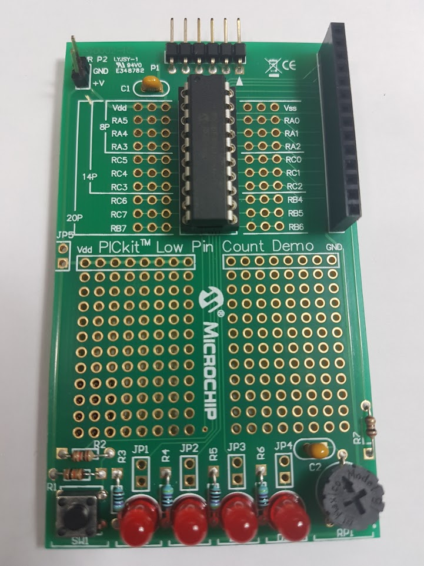

 

# PICKit 3 Low Pin Count Demo Board (8-bits)

The PICkit 3 Low Pin Count Demo Board (**DM164130-9**) is an update to the PICkit™ 2 Demo Board. Modifications to the previous LPC board (**DM164120-1**) were made so that the full functionality of the code can be debugged without the need of a debug header. The software has also been rewritten to accommodate new technologies. 

# Features

* Software is in both the ‘C’ and assembler language 
* Extension of the number of lessons and modules covered 
* MPLAB® X support as well as the older MPLAB® 8 
* New PIC16 enhanced mid-range and PIC18 routines 
* Uses the universal XC8 compiler 

