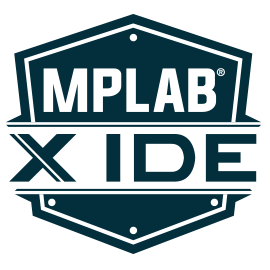

# Microchip MCU Code and Examples
 

Folders are arranged based on the model of the demo or development boards from Microchip, subfolders names are having the MCU part number if the board is having the option of plugging different types of MCUs otherwise the subfolder name will be only the project title.

All projects are done using Microchip MPLAB X IDE.
 

Enjoy !

Muthanna A. Attyah
