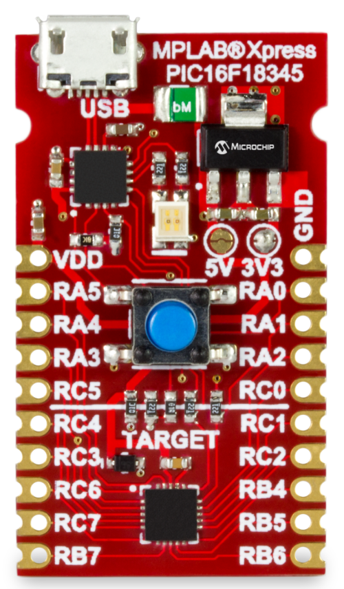

 
# Xpress PIC16F18345 Board (8-bits)

The MPLAB Xpress PIC16F8345 Evaluation Board (**DM164141**) has the PIC16F18345 MCU as the centerpiece of this MPLAB Xpress board. The product family features a high level of core independent peripherals that can be combined to perform a wide variety of functions without the core. The integration of the peripherals, allow for interconnections that bring a new level of interaction between peripherals enabling unsurpassed flexibility in creating functions for a wide range of applications including consumer electronics, Internet of Things (IoT) and wearable technology applications. These products also include power conserving functionality, including Idle/Doze operating modes and Peripheral Module Disable (PMD) in addition to XLP low-power technology.

# Features

* Integrates seamlessly with MPLAB Xpress cloud-based IDE and MPLAB Code Configurator for the quickest development cycle

* On-Board PIC16F18345 MCU Application Processor
 
* Integrated Drag-and-Drop Programmer with USB Interface- no drivers required!

* Compact footprint offers flexibility during prototyping phase

