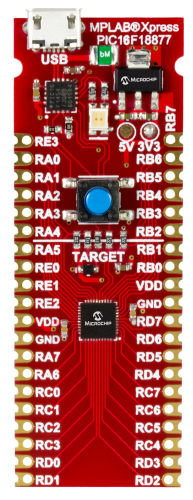

 

 

# Board (8-bits)

The MPLAB Xpress Evaluation Board (**DM164142**) has the PIC16F18877 MCU as the centerpiece of the MPLAB Xpress board. The product family features a 10-bit ADC with Computation (ADC2) for automated signal analysis, helping reduce system complexity. The MCUs include Core Independent Peripherals, communication, CRC/SCAN, Hardware Limit Timer (HLT) and Windowed WDT (WWDT) to support customers looking to add safety and monitoring to their system. Additionally, these products also feature power conserving functionality, including Idle/Doze operating modes, Peripheral Module Disable (PMD) and eXtreme Low-Power (XLP) technology for a wide range of applications. 

# Features

* Integrates seamlessly with MPLAB Xpress cloud-based IDE and MPLAB Code Configurator for the quickest development cycle

* On-Board PIC16F18877 MCU Application Processor

* Integrated Drag-and-Drop Programmer with USB Interface- no drivers required!

* Compact footprint offers flexibility during prototyping phase

